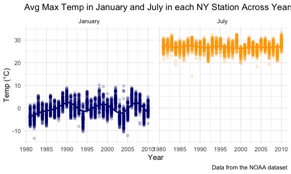

HW 3 for P8105 - hlz2108
================
Helen Zhang
October 5, 2020

### Due date

Due: October 10 at 10:00pm.

### Points

| Problem         | Points    |
| :-------------- | :-------- |
| Problem 0       | 20        |
| Problem 1       | –         |
| Problem 2       | 40        |
| Problem 3       | 40        |
| Optional survey | No points |

Below is the code for setup:

``` r
library(tidyverse)
```

    ## ── Attaching packages ──────────────────────────── tidyverse 1.3.0 ──

    ## ✓ ggplot2 3.3.2     ✓ purrr   0.3.4
    ## ✓ tibble  3.0.3     ✓ dplyr   1.0.2
    ## ✓ tidyr   1.1.2     ✓ stringr 1.4.0
    ## ✓ readr   1.3.1     ✓ forcats 0.5.0

    ## ── Conflicts ─────────────────────────────── tidyverse_conflicts() ──
    ## x dplyr::filter() masks stats::filter()
    ## x dplyr::lag()    masks stats::lag()

``` r
library(dplyr)
library(readxl)
library(ggplot2)
library(p8105.datasets)

knitr::opts_chunk$set(
  fig.width = 6,
  fig.asp = .6,
  out.width = "90%"
)
theme_set(theme_minimal() + theme(legend.position = "bottom"))
options(
  ggplot2.continuous.colour = "viridis",
  ggplot2.continuous.fill = "viridis"
)
scale_colour_discrete = scale_color_viridis_d
scale_fill_discrete = scale_fill_viridis_d
```

## Problem 0

This “problem” focuses on structure of your submission, especially the
use git and GitHub for reproducibility, R Projects to organize your
work, R Markdown to write reproducible reports, relative paths to load
data from local files, and reasonable naming structures for your files.

## Problem 1

``` r
data("instacart")
```

This dataset contains 1384617 rows and 15 columns.

Observations are the level of items in order by user.

How many aisles, and which are most items ordered from?

``` r
instacart %>% 
  count(aisle) %>% 
  arrange(desc(n))
```

    ## # A tibble: 134 x 2
    ##    aisle                              n
    ##    <chr>                          <int>
    ##  1 fresh vegetables              150609
    ##  2 fresh fruits                  150473
    ##  3 packaged vegetables fruits     78493
    ##  4 yogurt                         55240
    ##  5 packaged cheese                41699
    ##  6 water seltzer sparkling water  36617
    ##  7 milk                           32644
    ##  8 chips pretzels                 31269
    ##  9 soy lactosefree                26240
    ## 10 bread                          23635
    ## # … with 124 more rows

Let’s make a plot\! This plot shows the number of items ordered in each
aisle, limited to aisles with more than 10000 items ordered.

``` r
instacart %>% 
  count(aisle) %>% 
  filter(n > 10000) %>% 
  mutate(
    aisle = factor(aisle),
    aisle = fct_reorder(aisle, n)
  ) %>% 
  ggplot(aes(x = aisle, y = n)) +
  geom_point() + 
  theme(axis.text.x = element_text(angle = 90, vjust = 0.5, hjust = 1))
```


Let’s make a table\! This table shows the three most popular items in
each of the aisles “baking ingredients”, “dog food care”, and “packaged
vegetables fruits” and the number of times each item is ordered.

``` r
instacart %>% 
  filter(aisle %in% c("baking ingredients", "dog food care", "packaged vegetables fruits")) %>% 
  group_by(aisle) %>% 
  count(product_name) %>% 
  mutate(rank = min_rank(desc(n))) %>% 
  filter(rank < 4) %>% 
  arrange(aisle, rank) %>% 
  knitr::kable()
```

| aisle                      | product\_name                                 |    n | rank |
| :------------------------- | :-------------------------------------------- | ---: | ---: |
| baking ingredients         | Light Brown Sugar                             |  499 |    1 |
| baking ingredients         | Pure Baking Soda                              |  387 |    2 |
| baking ingredients         | Cane Sugar                                    |  336 |    3 |
| dog food care              | Snack Sticks Chicken & Rice Recipe Dog Treats |   30 |    1 |
| dog food care              | Organix Chicken & Brown Rice Recipe           |   28 |    2 |
| dog food care              | Small Dog Biscuits                            |   26 |    3 |
| packaged vegetables fruits | Organic Baby Spinach                          | 9784 |    1 |
| packaged vegetables fruits | Organic Raspberries                           | 5546 |    2 |
| packaged vegetables fruits | Organic Blueberries                           | 4966 |    3 |

Apples vs. Ice-Cream Making a second table. This table shows the mean
hour of the day at which Pink Lady Apples and Coffee Ice Cream are
ordered on each day of the week.

``` r
instacart %>% 
  filter(product_name %in% c("Pink Lady Apples", "Coffee Ice Cream")) %>% 
  group_by(product_name, order_dow) %>% 
  summarise(mean_hour = mean(order_hour_of_day)) %>% 
  pivot_wider(
    names_from = order_dow,
    values_from = mean_hour
  )
```

    ## `summarise()` regrouping output by 'product_name' (override with `.groups` argument)

    ## # A tibble: 2 x 8
    ## # Groups:   product_name [2]
    ##   product_name       `0`   `1`   `2`   `3`   `4`   `5`   `6`
    ##   <chr>            <dbl> <dbl> <dbl> <dbl> <dbl> <dbl> <dbl>
    ## 1 Coffee Ice Cream  13.8  14.3  15.4  15.3  15.2  12.3  13.8
    ## 2 Pink Lady Apples  13.4  11.4  11.7  14.2  11.6  12.8  11.9

## Problem 2

``` r
accel_df = 
  read_csv("./data/accel_data.csv", col_types = cols(
      week = col_integer(),
      day_id = col_integer()
      )) %>%
  janitor::clean_names() %>% 
  mutate(
    weekend = case_when(
      day == "Monday" ~ "weekday",
      day == "Tuesday" ~ "weekday",
      day == "Wednesday" ~ "weekday",
      day == "Thursday" ~ "weekday",
      day == "Friday" ~ "weekday",
      day == "Saturday" ~ "weekend",
      day == "Sunday" ~ "weekend"
)) %>% 
  relocate("weekend") %>%
  pivot_longer(
    activity_1:activity_1440, 
    names_to = "activity",
    values_to = "activity_count") %>% 
  separate(activity, into = c("activity", "activity_minute")) %>%
  select(-activity) %>%
  mutate(
    activity_minute = as.numeric(activity_minute),
    day = factor(day),
    day = fct_relevel(day, c("Monday", "Tuesday", "Wednesday", "Thursday", "Friday", "Saturday", "Sunday"))
    ) %>% view
```

The accel data set contains 50400 rows and 6 columns. The dataset
contains 5 weeks of accelerometer data collected from a 63 year-old male
with BMI 25, who was admitted to the Advanced Cardiac Care Center of
Columbia University Medical Center and diagnosed with congestive heart
failure (CHF). The variables in this dataset are weekend, week, day\_id,
day, activity\_minute, activity\_count. Below is a detailed description
of several variables of interest:

  - *day\_id* is a integer variable and indicates the day the
    accelerometer data was collected.

  - *day* is a factor variable that was created in order to make the
    original `day_id` variable easier to understand.

  - *week* is a integer variable and indicates the week the
    accelerometer data was collected.

  - *weekend* is a character variable that indicates whether the
    information was collected on a weekend vs. a weekday.

  - *activity\_minute* is a numeric variable that indicates the minute
    when the activity count was collected, corresponding to each minute
    of a 24-hour day starting at midnight.

<!-- end list -->

``` r
accel_df %>% 
  group_by(day_id, day) %>%
  summarize(total_activity = sum(activity_count)) %>% 
  knitr::kable()
```

    ## `summarise()` regrouping output by 'day_id' (override with `.groups` argument)

| day\_id | day       | total\_activity |
| ------: | :-------- | --------------: |
|       1 | Friday    |       480542.62 |
|       2 | Monday    |        78828.07 |
|       3 | Saturday  |       376254.00 |
|       4 | Sunday    |       631105.00 |
|       5 | Thursday  |       355923.64 |
|       6 | Tuesday   |       307094.24 |
|       7 | Wednesday |       340115.01 |
|       8 | Friday    |       568839.00 |
|       9 | Monday    |       295431.00 |
|      10 | Saturday  |       607175.00 |
|      11 | Sunday    |       422018.00 |
|      12 | Thursday  |       474048.00 |
|      13 | Tuesday   |       423245.00 |
|      14 | Wednesday |       440962.00 |
|      15 | Friday    |       467420.00 |
|      16 | Monday    |       685910.00 |
|      17 | Saturday  |       382928.00 |
|      18 | Sunday    |       467052.00 |
|      19 | Thursday  |       371230.00 |
|      20 | Tuesday   |       381507.00 |
|      21 | Wednesday |       468869.00 |
|      22 | Friday    |       154049.00 |
|      23 | Monday    |       409450.00 |
|      24 | Saturday  |         1440.00 |
|      25 | Sunday    |       260617.00 |
|      26 | Thursday  |       340291.00 |
|      27 | Tuesday   |       319568.00 |
|      28 | Wednesday |       434460.00 |
|      29 | Friday    |       620860.00 |
|      30 | Monday    |       389080.00 |
|      31 | Saturday  |         1440.00 |
|      32 | Sunday    |       138421.00 |
|      33 | Thursday  |       549658.00 |
|      34 | Tuesday   |       367824.00 |
|      35 | Wednesday |       445366.00 |

Activity counts were at their lowest on the two Saturdays prior to end
of data collection (weeks 4 and 5). The individual appears to be most
active on the days leading up to and after the weekend, and during the
weekend (Friday-Monday).

``` r
accel_df %>% 
  ggplot(aes(x = activity_minute, y = activity_count, color = day)) + 
  geom_line() +
  labs(
    title = "24-Hour Activity Count by Day",
    x = "Time",
    y = "Activity Count",
    caption = "Data from the accel dataset"
  ) + 
  scale_x_continuous(
    breaks = c(0, 360, 720, 1080, 1440), 
    labels = c("12AM", "6AM", "12PM", "6PM", "11:59PM"),
    limits = c(0, 1440)
    )
```


Activity is lowest during sleeping hours, the individual appears to be
more active on the weekends, in the evening hours around 8-10pm.

## Problem 3

Loading dataset.

``` r
data("ny_noaa")
```

The NY\_NOAA dataset contains information taken from the NOAA National
Climatic Data Center. It contains information from all New York state
weather stations from January 1, 1981 through December 31, 2010. The
NOAA dataset contains 2595176 rows and 7 columns.

The variables in the data set are:

  - `id`: Weather station ID
  - `date`: Date of observation
  - `prcp`: Precipitation (tenths of mm)
  - `snow`: Snowfall (mm)
  - `snwd`: Snow depth (mm)
  - `tmax`: Maximum temperature (tenths of degrees C)
  - `tmin`: Minimum temperature (tenths of degrees C)

Because not all weather stations in NY collect all these variables, the
original dataset contains extensive amount of missing data.

``` r
noaa_tidy = ny_noaa %>% 
  separate(date, into = c("year", "month", "day")) %>%
  mutate(
    prcp = prcp / 10 ,
    tmax = as.numeric(tmax) / 10,
    tmin = as.numeric(tmin) / 10,
    year = as.numeric(year),
    day = as.numeric(day),
    month = recode_factor(month,
          "01" = "January",
          "02" = "February",
          "03" = "March",
          "04" = "April",
          "05" = "May",
          "06" = "June",
          "07" = "July",
          "08" = "August",
          "09" = "September",
          "10" = "October",
          "11" = "November",
          "12" = "December"
    )) %>% 
  relocate(year, month, day, everything())
```

Several variables were converted into standard units. `prcp`, which was
measured in tenths of mm, was converted into mm and `tmax` and `tmin`,
which were measured in tenths of degrees C, was converted into degrees
C.

``` r
noaa_tidy %>% 
  count(snow) %>%
  arrange(desc(n))
```

    ## # A tibble: 282 x 2
    ##     snow       n
    ##    <int>   <int>
    ##  1     0 2008508
    ##  2    NA  381221
    ##  3    25   31022
    ##  4    13   23095
    ##  5    51   18274
    ##  6    76   10173
    ##  7     8    9962
    ##  8     5    9748
    ##  9    38    9197
    ## 10     3    8790
    ## # … with 272 more rows

From the dataframe above, you can see that the most commonly observed
value for snowfall was 0, indicating that on most days in NYS, it is not
snowing. This makes sense as snow is most likely to occur during the
winter season (\~3 months or so), and not year round.

``` r
tmax_noaa = noaa_tidy %>% 
  filter(month %in% c("January", "July")) %>% 
  group_by(id, year, month) %>% 
  summarize(mean_tmax = mean(tmax, na.rm = TRUE))
```

    ## `summarise()` regrouping output by 'id', 'year' (override with `.groups` argument)

``` r
ggplot(tmax_noaa, aes(x = year, y = mean_tmax, group = id, color = id)) +
  geom_point(alpha = 0.2) +
  geom_line(alpha = 0.5) +
  labs(
    title = "Avg Max Temp in January and July in each NY Station Across Years",
    x = "Year",
    y = "Temp (°C)",
    caption = "Data from the NOAA dataset"
  ) +
  scale_x_continuous(
    breaks = c(1980, 1985, 1990, 1995, 2000, 2005, 2010)
    ) +
  facet_grid(. ~ month) +
  theme(
    legend.position = "none")
```

    ## Warning: Removed 5970 rows containing missing values (geom_point).

    ## Warning: Removed 5640 row(s) containing missing values (geom_path).



The average max temp in January is usually within the -10-10°C range.
The lowest max temperature recorded was \~-14°C. There does not appear
to be a significant different in average max temperatures throughout the
years. One could say that there may be a slight increase in max
temperatures when comparing 1980 vs. 2010 but it is difficult to
determine whether there is any significant difference from the two-panel
plot generated.

Average max temperatures in July appear to be in the 25-30°C range.
There is one outlier where the max temp for July was \~14°C but
generally speaking, most values are within the 25-30°C range. There does
not appear to be a significant difference in average max temperatures in
July throughout the years. However, 2010 did have one of the highest
average temperatures, as high as \~33°C.

Make a two-panel plot showing (i) tmax vs tmin for the full dataset
(note that a scatterplot may not be the best option); and (ii) make a
plot showing the distribution of snowfall values greater than 0 and less
than 100 separately by year.
